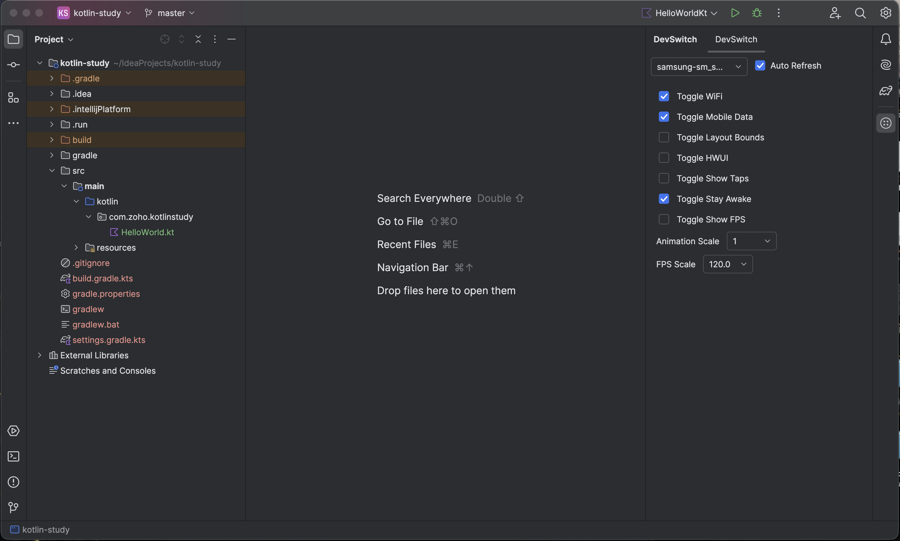

# DevSwitch

<p align="center">
  <strong>Quickly toggle Android developer settings on connected devices directly from your IDE.</strong>
</p>

<p align="center">
  
</p>

<p align="center">
  <a href="#features">Features</a> •
  <a href="#installation">Installation</a> •
  <a href="#usage">Usage</a> •
  <a href="#supported-settings">Supported Settings</a> •
  <a href="#requirements">Requirements</a> •
  <a href="#building">Building</a>
</p>

---

## Features

- **Quick Access** - Control developer options without leaving your IDE
- **Real-time Device Detection** - Automatically detects connected Android devices via ADB
- **One-Click Toggles** - Enable/disable developer settings with a single click
- **Multi-Device Support** - Switch between multiple connected devices seamlessly
- **Auto-Refresh** - Settings automatically sync with device state

## Installation

1. Open IntelliJ IDEA or Android Studio
2. Go to `Settings/Preferences` → `Plugins` → `Marketplace`
3. Search for "DevSwitch"
4. Click `Install`

## Usage

1. Connect your Android device via USB (with USB debugging enabled)
2. Open the **DevSwitch** tool window from the right sidebar
3. Select your device from the dropdown
4. Toggle settings as needed!

## Supported Settings

### Toggle Controls

| Setting | Description |
|---------|-------------|
| **WiFi** | Enable/disable WiFi |
| **Mobile Data** | Enable/disable mobile data |
| **Show Layout Bounds** | Display view boundaries for debugging layouts |
| **Profile GPU Rendering** | Show HWUI visual bars for performance analysis |
| **Show Taps** | Display touch feedback on screen |
| **Stay Awake** | Keep screen on while charging |
| **Show FPS** | Display frame rate overlay |

### Range Controls

| Setting | Description |
|---------|-------------|
| **Animation Scale** | Adjust window/transition/animator duration (1x-10x) |
| **Refresh Rate** | Change display refresh rate (device-dependent) |

## Requirements

- **IDE**: IntelliJ IDEA 2023.1+ or Android Studio Hedgehog+
- **Android Device**: 
  - USB debugging enabled
  - Developer Options enabled
- **ADB**: Android SDK Platform Tools installed
  - Set `ANDROID_HOME` or `ANDROID_SDK_ROOT` environment variable, OR
  - Have ADB in your system PATH, OR
  - Default SDK location (auto-detected)

## Building

### Prerequisites
- JDK 17+
- Gradle 8.0+

### Build Commands

```bash
# Clone the repository
git clone https://github.com/tinkrmux/DevSwitch.git
cd DevSwitch

# Build the plugin
./gradlew build

# Run the plugin in a sandbox IDE
./gradlew runIde

# Build distributable ZIP
./gradlew buildPlugin
```

The built plugin will be available at `build/distributions/DevSwitch-*.zip`

## Project Structure

```
DevSwitch/
├── src/main/kotlin/com/tinkrmux/devswitch/
│   ├── Actions.kt                          # Toggle and Range actions
│   ├── AdbDeviceManager.kt                 # ADB device detection
│   ├── AndroidQuickSettingsWindowFactory.kt # Tool window factory
│   ├── ComposeComponents.kt                # UI components
│   ├── Controller.kt                       # State management
│   ├── ControllerExtensions.kt             # Controller extensions
│   └── PluginTheme.kt                      # Theme configuration
├── src/main/resources/
│   ├── META-INF/plugin.xml                 # Plugin configuration
│   └── icons/                              # Plugin icons
├── .github/workflows/build.yml             # CI/CD pipeline
├── build.gradle.kts
└── settings.gradle.kts
```

## Contributing

Contributions are welcome! Please feel free to submit a Pull Request.

1. Fork the repository
2. Create your feature branch (`git checkout -b feature/amazing-feature`)
3. Commit your changes (`git commit -m 'Add some amazing feature'`)
4. Push to the branch (`git push origin feature/amazing-feature`)
5. Open a Pull Request

## License

This project is licensed under the MIT License - see the [LICENSE](LICENSE) file for details.

## Author

**tinkrmux**

- Email: admin@tinkrmux.com

---

<p align="center">
  Made with ❤️ for Android Developers
</p>
